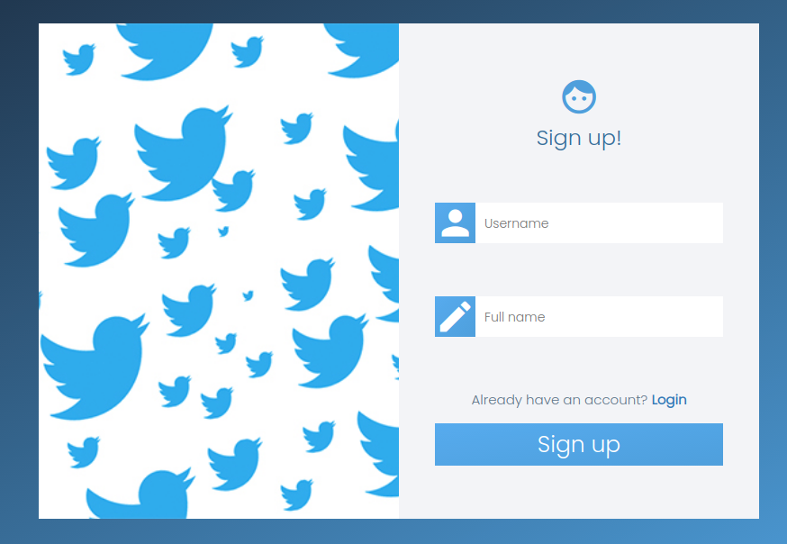
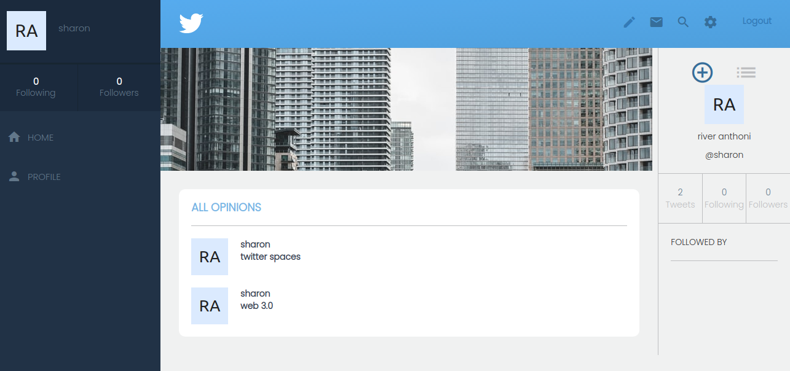

# Twitter-Redesign

This project puts your knowledge of ruby on rails module into practice through the Twitter-Redesign and app that allows user to login, view homepage/tweets, suggestion on who to follow, access their user profile and those of others, and creating tweets.



## Built With

- Ruby -v 2.7.0
- Rails -v 6.1.1
- Guard
- Bootstrap
- PostgreSQL
- RSPEC

## Live Demo

- [Live Demo Link](https://fierce-spire-26749.herokuapp.com/)

- [Video](https://www.loom.com/share/459aebb647ef46daab87de530ccd8970)



## Getting Started

### Prerequisites

To get this project up and running locally, you must already have ruby and rails plus the necessary gems installed on your computer

**simple steps set up on your local machine**

```
- $ git clone `$ git clone https://github.com/jebitok-dev/Twitter-Redesign`
- $ git checkout develop
- Run `cd Twitter-Redesign`
- $ bundle install
- $ rails db:create
- $ rails db:migrate
```

### Run Tests

- `$ rspec spec/models/user_spec.rb `
- `$ rspec spec/models/opinion_spec.rb`
- `$ rspec spec/feature/user_login_spec.rb`
- `$ rspec spec/feature/opinion_create_spec.rb`

## Author

👤 **Sharon Jebitok**

- Github: [jebitok-dev](https://github.com/jebitok-dev)
- Twitter: [@jsebitok](https://twitter.com/jsebitok)
- LinkedIn: [Sharon Jebitok](https://www.linkedin.com/in/sharon-jebitok/)

## 🤝 Contributing

Contributions, issues and feature requests are always welcome!

I love meeting other developers, especially ones that give me advice on how to improve my work.

Feel free to check the [issues page](https://github.com/jebitok-dev/Twitter-Redesign/issues).

### How to Contribute

To get a local copy up and running follow these simple example steps.

````
- Fork the repository
- git clone https://github.com/your_username/Twitter-Redesign
- git checkout develop
- git checkout -b branch name
- run ```$ bundle install```
- $ rails db:create
- $ rails db:migrate
- git remote add upstream https://github.com/jebitok-dev/Twitter-Redesign
- git pull upstream develop
- git commit -m "commit message"
- git push -u origin HEAD
````

## Show your support

Finally, if you've read this far, don't forget to give this repo a ⭐️. They're free . . . I think.

## Acknowledgments

- [Microverse](https://microverse.org).
- Design idea by [Gregoire Vella on Behance](https://www.behance.net/gregoirevella)

<!-- ## 📝 License -->
